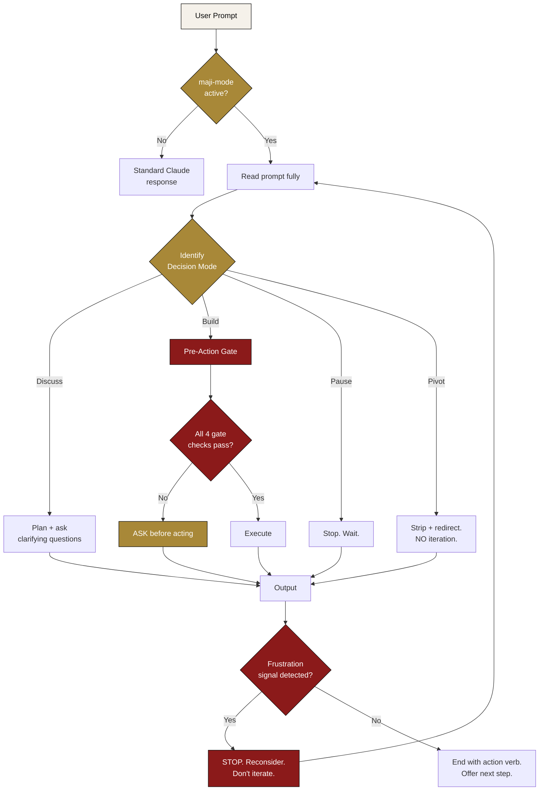
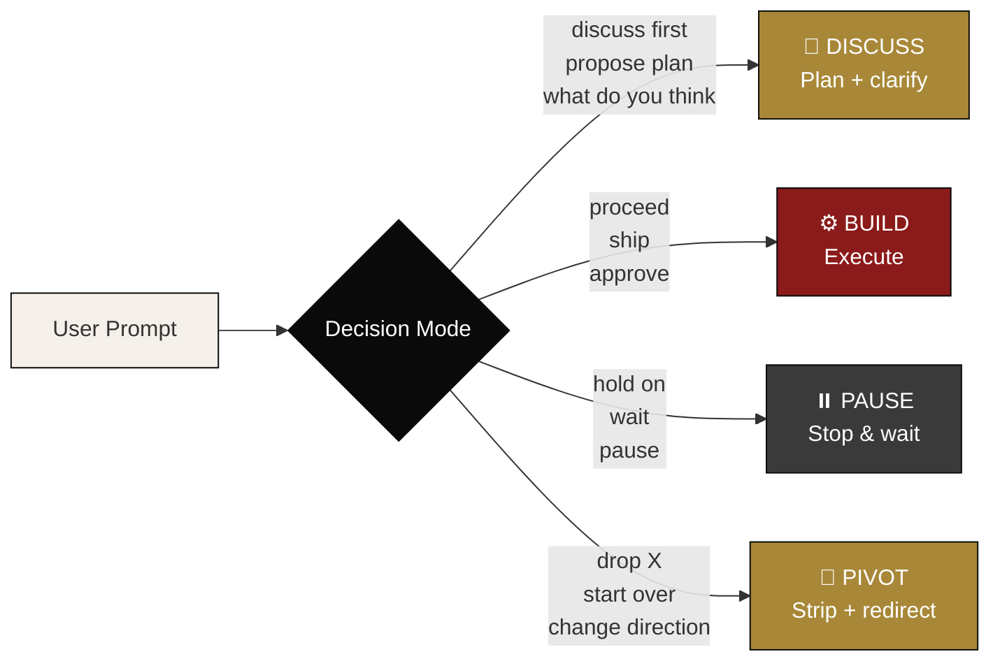
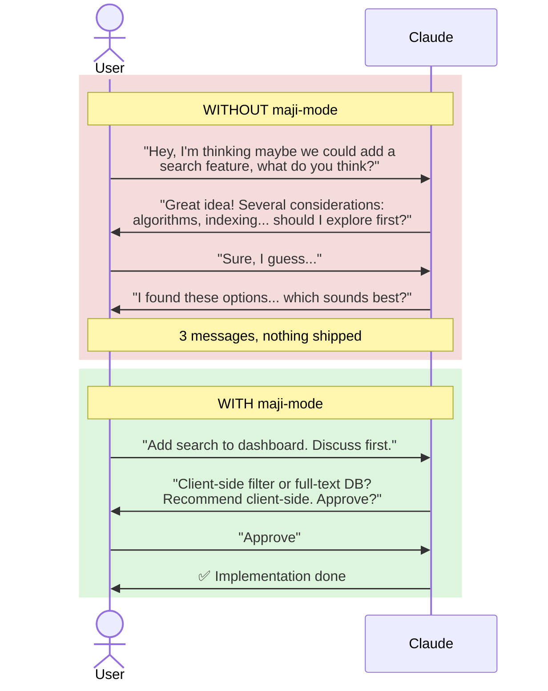
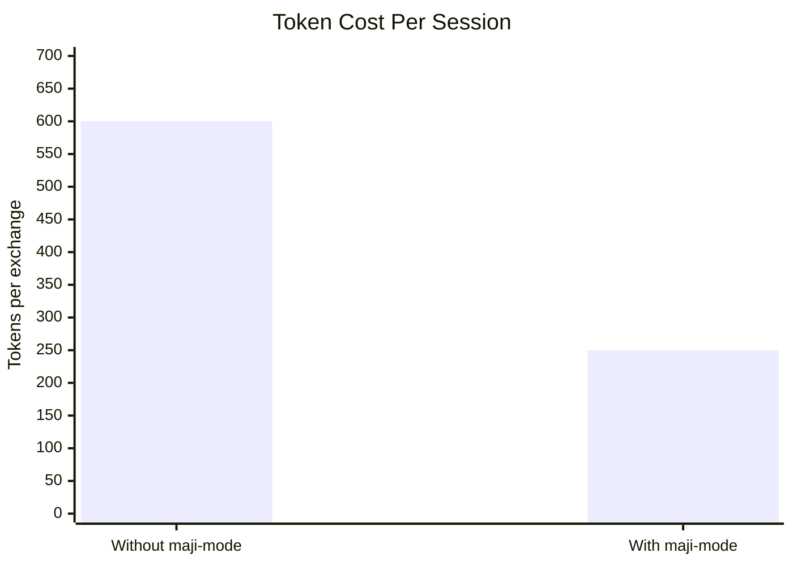

# 🛠 MAJI Skills

[](./LICENSE)
[](https://docs.claude.com/en/docs/claude-code)
[](https://maji.org)

A growing collection of Claude skills that make AI collaboration **tighter, faster, and less wasteful**.

These skills are derived from the actual working patterns of **[Zarul Izham (Ijam)](https://www.linkedin.com/in/zarulijam/)** — Founder of MAJI — built and refined over thousands of Claude Code sessions. The patterns aren't theoretical: each one solves a real failure mode encountered when shipping daily with AI.

By [MAJI](https://maji.org) · *No Codes, Only Vibes.*

---

## ✨ Skills in this Repo

### `maji-mode` — Claude Collaboration Discipline

A discipline layer between you and Claude. Activates 4 patterns that make Claude listen properly the first time — saving tokens, reducing rework, and preventing scope drift.

[→ Read the full skill](./maji-mode/SKILL.md)

---

## 🧠 How `maji-mode` Works



The 4 patterns:

1. **Outcome before context** — say what you want, Claude responds; rationale optional
2. **Mode-tagged prompts** — discuss / build / pause / pivot — Claude treats them differently
3. **Frustration recognition** — when you signal "wrong direction", Claude halts instead of doubling down
4. **Pre-action confirmation** — destructive or scope-expanding actions need explicit OK

---

## 📊 Decision Modes Visualised



---

## 🚀 Why use these skills?

| Benefit | What changes for you |
|---|---|
| ⚡ **Less rework** | Claude stops extrapolating wrong scope |
| 🚄 **Faster shipping** | Outcome-first prompts get answers in 1 turn instead of 3 |
| 💰 **Saves tokens** | Leaner exchanges = less context burned, lower API cost |
| 🛑 **Frustration aware** | Claude halts and reconsiders when you signal "wrong direction" |
| 🎯 **Decision modes** | Explicit discuss/build/pause/pivot — no ambiguity |
| 🚧 **Pre-Action Gate** | Risky ops need confirmation before execution |
| 🌐 **Universal** | Works across any project, any domain |
| 📈 **Compounds** | Teaches you to prompt better — works even outside Claude |

---

## 🎬 Real Before/After Examples

<details>
<summary><strong>📌 Example 1 — Building a Feature</strong></summary>



**Saved:** ~1500 tokens, 3 round-trips, mental overhead.

</details>

<details>
<summary><strong>📌 Example 2 — The "Proceed" Trap</strong></summary>

**Without maji-mode**
> User: *"Let's proceed phase by phase, plan stories and epics"*
> Claude: *[scaffolds 10 stories, runs npm install, commits 11 times]*
> User: *"Wait, what are you doing?"* → has to delete everything.

**With maji-mode**
> User: *"Let's proceed phase by phase, plan stories and epics"*
> Claude: *"Reading 'proceed' in discussion context — continuing to plan, not building yet."*
> No surprise commits.

**Saved:** ~3 hours and a deleted repo.

</details>

<details>
<summary><strong>📌 Example 3 — Aesthetic Mismatch</strong></summary>

**Without maji-mode**
> User: *"That doesn't look right"*
> Claude: *"Let me try a different color scheme..."* [makes 5 changes]
> User: *"Still wrong"*
> Claude: *"Let me try yet another approach..."* [user rage-quits]

**With maji-mode**
> User: *"Not the right vibe"*
> Claude: *"STOP — pivoting completely instead of iterating. Show me 1-2 reference sites with the look you want, or describe in 5 words."*
> User: *"Linear style — minimal, dark, generous spacing"* → clean pivot.

**Saved:** Massive frustration + 5+ wasted attempts.

</details>

<details>
<summary><strong>📌 Example 4 — Destructive Action</strong></summary>

**Without maji-mode**
> User: *"Clean up old branches"*
> Claude: *[force-deletes branches, resets remote tracking, some unmerged work disappears]*

**With maji-mode**
> User: *"Clean up old branches"*
> Claude: *"Pre-Action Gate: destructive op detected. Found 12 branches. Show list before delete?"*
> User reviews → surgical cleanup, no surprise loss.

**Saved:** Lost work prevention. Trust preserved.

</details>

<details>
<summary><strong>📌 Example 5 — Token Burn</strong></summary>

**Without maji-mode** (~200 tokens of padding alone)
> "Great question! That's a really thoughtful approach. Let me think through this carefully and consider the various angles. I appreciate you bringing this up. Here's what I'm thinking..."

**With maji-mode**
> "3 options. Recommend (b). Reason: ships fastest. [table]"

**Saved:** Across 50 messages = ~10,000 tokens = real $.

</details>

---

## 💸 Token Economy Math



| Item | Without `maji-mode` | With `maji-mode` |
|---|---|---|
| Avg prompt+response | ~600 tokens | ~250 tokens |
| Savings per exchange | — | **~58%** |
| 100-message session | — | ~35,000 tokens saved |
| Power user (5 sessions/day) | — | **~$15/day** saved on Pro tier |

---

## 📦 Installation

<details>
<summary><strong>Option 1 — User-level (recommended, applies to all projects)</strong></summary>

```bash
mkdir -p ~/.claude/skills
git clone https://github.com/Ijam18/MAJI-Skills.git
cp -r MAJI-Skills/maji-mode ~/.claude/skills/
```

</details>

<details>
<summary><strong>Option 2 — Project-level (single project only)</strong></summary>

```bash
mkdir -p ./.claude/skills
git clone https://github.com/Ijam18/MAJI-Skills.git
cp -r MAJI-Skills/maji-mode ./.claude/skills/
```

</details>

<details>
<summary><strong>Option 3 — Always-on (loaded every session, every project)</strong></summary>

Append the contents of `maji-mode/SKILL.md` to your `~/.claude/CLAUDE.md` file:

```bash
git clone https://github.com/Ijam18/MAJI-Skills.git
cat MAJI-Skills/maji-mode/SKILL.md >> ~/.claude/CLAUDE.md
```

</details>

---

## ▶️ Usage

After installation, invoke at the start of any Claude Code session:

```
/maji-mode
```

Or it auto-activates via Claude's skill discovery if installed at user-level.

To verify it's active, your prompts should feel:
- More direct (less preamble)
- Better at scope (Claude asks before extrapolating)
- Token-aware (shorter responses by default)

---

## 👥 Who benefits most

| User type | Benefit fit |
|---|---|
| 🚀 Solo founders + indie hackers | High |
| 🌊 Vibe-coders (no formal CS) | **Highest** |
| 👨‍💻 Senior devs using AI as pair programmer | High |
| 🎨 Designers using Claude for code | High |
| 🎓 Teaching contexts | High |
| 🛠 Casual / weekend tinkerers | Lower (overhead may exceed benefit) |

---

## 💬 Questions or Feedback?

Have questions about how to use these skills, or feedback after trying them?

→ **LinkedIn:** [Zarul Izham (Ijam)](https://www.linkedin.com/in/zarulijam/)
→ **Threads:** [@_zarulijam](https://www.threads.com/@_zarulijam)

DMs open. Tag the repo when sharing your experience — happy to feature builders using `maji-mode` in the wild.

---

## 🤝 Contributing

PRs welcome. Patterns to add should be:

- ✅ Universal (not specific to one project / language / domain)
- ✅ Token-positive (saves tokens, doesn't cost more)
- ✅ Easy to explain in 1-2 sentences
- ✅ Backed by a real failure mode the pattern prevents

---

## 📜 License

MIT — use freely, modify freely, attribute when you can. See [LICENSE](./LICENSE).

---

## 🌱 About MAJI

MAJI (Malaysia Artificial Joint Institute) is an Applied AI learning movement based in Malaysia. We believe AI is the joint between people, industries, and disciplines.

**Methodology:** *No Codes, Only Vibes* — we don't teach coding, we teach building.

Learn more: [maji.org](https://maji.org)
