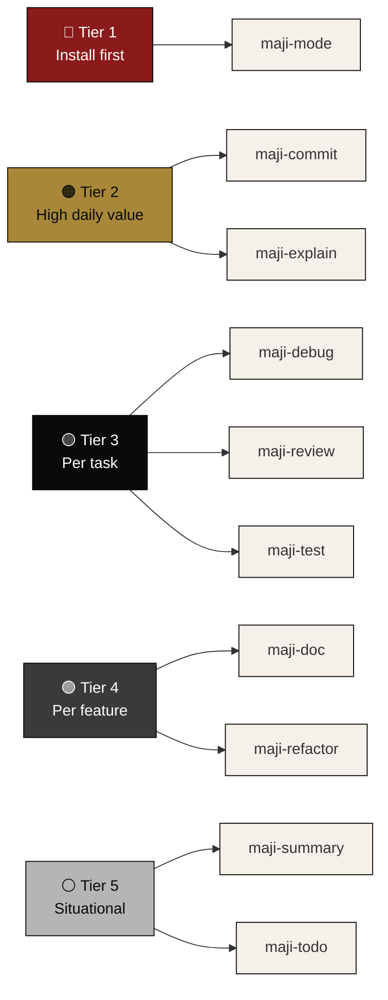
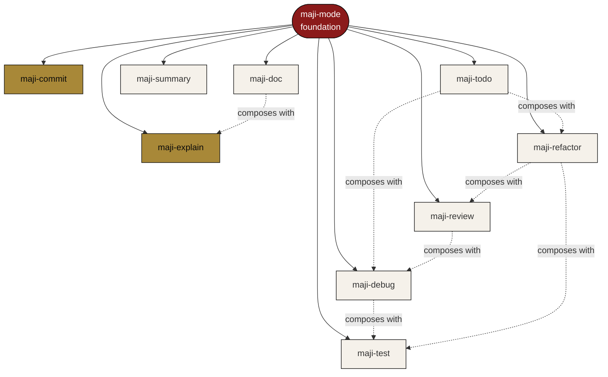
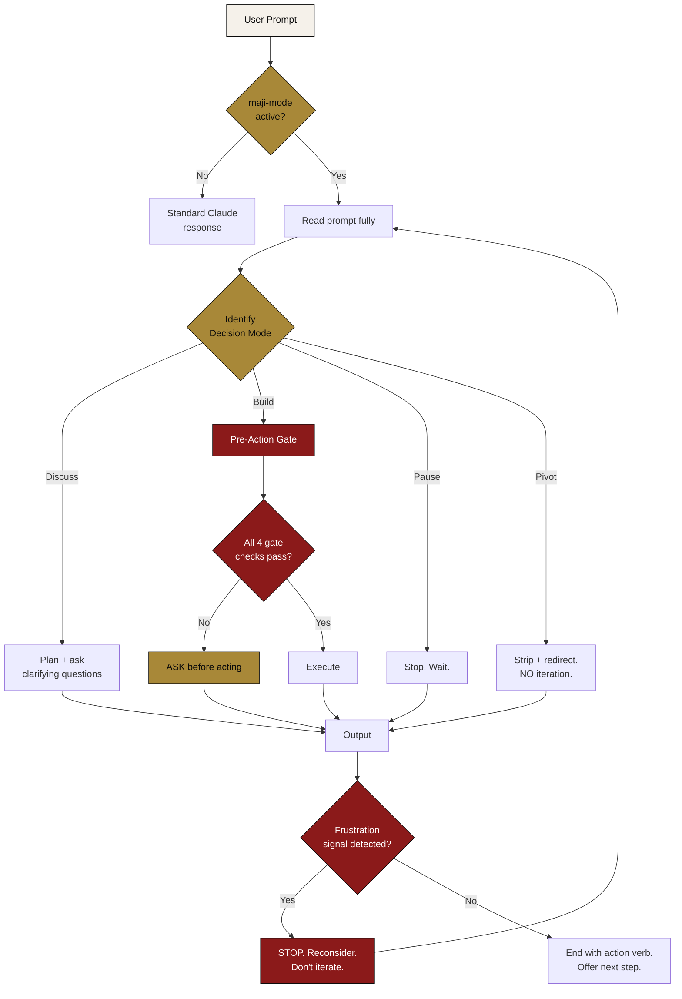
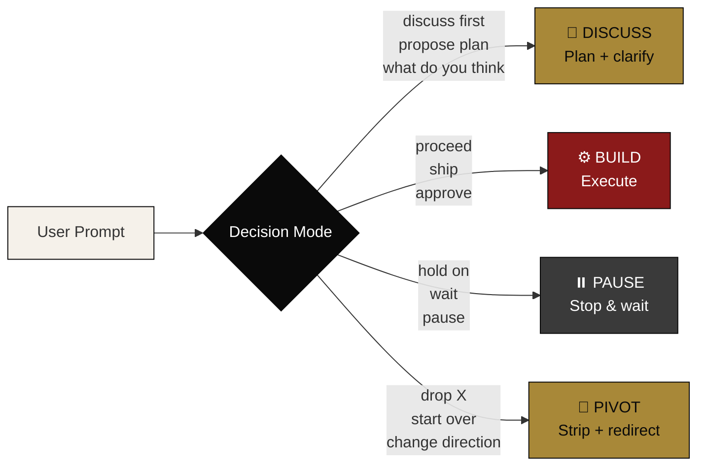
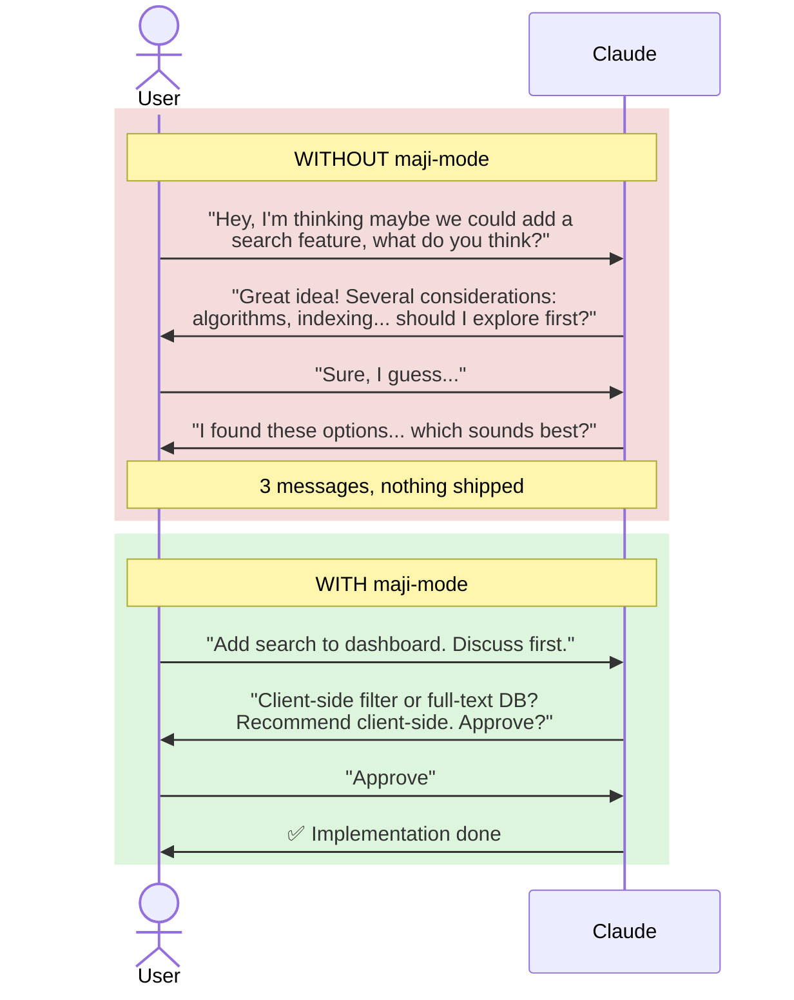
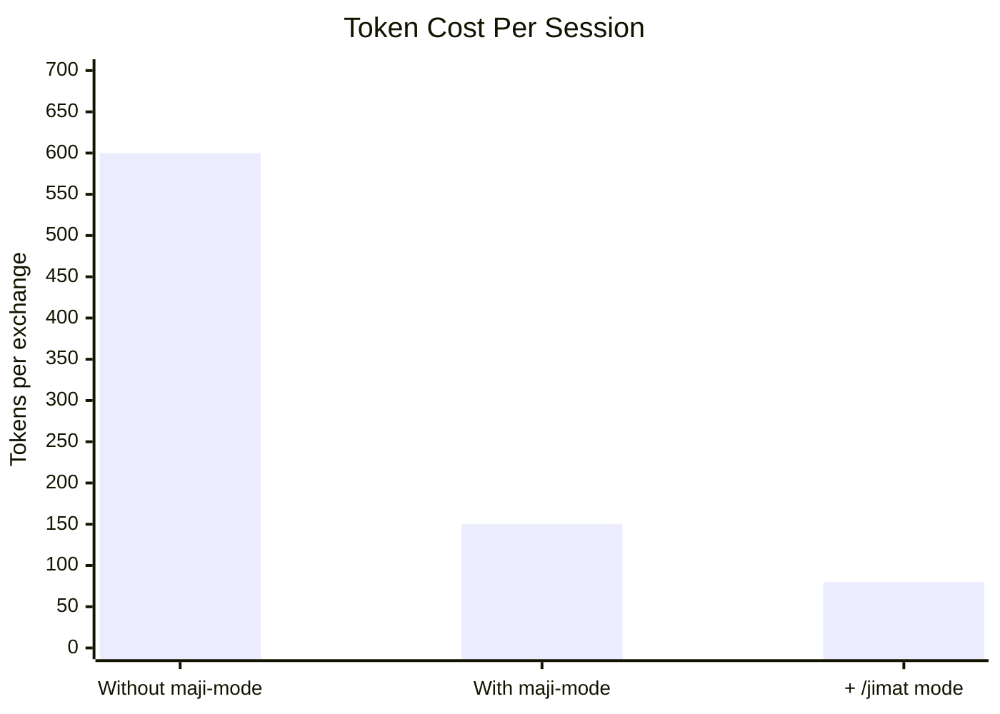

<div align="center">

# 🛠 MAJI Skills

### **Stop repeating yourself to Claude.**

Four patterns that make Claude listen the first time. Save **~75% tokens**. Ship without rework. Free.

[](./LICENSE)
[](https://docs.claude.com/en/docs/claude-code)
[](https://maji.org)

[**⬇️ Install in 30 seconds**](#-installation) · [**⭐ Star this repo**](https://github.com/Ijam18/MAJI-Skills) · [**🔗 Share on LinkedIn**](https://www.linkedin.com/sharing/share-offsite/?url=https%3A%2F%2Fgithub.com%2FIjam18%2FMAJI-Skills)

</div>

---

## 🎯 Why You Should Use MAJI Skills

Every Claude Code session, you're fighting the same battles:

- 😩 Claude **extrapolates beyond what you asked** — fixes the typo AND refactors three files you didn't want touched
- 💸 Token bills creep up because Claude responds with **paragraphs of preamble** before the actual answer
- 🔁 You have to **re-explain your working style every session** — Claude forgets you want bullets, not essays
- 🚨 Claude treats "let's discuss this" as "let's build it now" — and you delete 11 commits to recover
- 😤 When you say *"that's not right"*, Claude tries variant 2, variant 3 — instead of stopping to ask what you actually want

**MAJI Skills fix all of this** with a discipline layer that activates on every prompt.

> *"This is the closest thing to having a senior dev who actually reads your message before responding."*

### What you get in 30 seconds:

✅ Claude recognises **outcome-first prompts** and skips the padding
✅ **Decision modes** — discuss / build / pause / pivot — eliminate ambiguity
✅ **Frustration signals halt Claude** instead of doubling down
✅ **Pre-Action Gate** prevents destructive surprises (force pushes, scope creep)
✅ **~75% token savings** per exchange — banned padding phrases, compression modes, table-first output
✅ Works on **any project, any language, any stack**
✅ Free, MIT licensed, no signup, no telemetry

[**→ Install now**](#-installation) · [**→ See real before/after examples**](#-real-beforeafter-examples)

---

## 📖 Background

A growing collection of Claude skills that make AI collaboration **tighter, faster, and less wasteful**.

These skills are derived from the actual working patterns of **[Zarul Izham (Ijam)](https://www.linkedin.com/in/zarulijam/)** — Founder of MAJI — built and refined over thousands of Claude Code sessions. The patterns aren't theoretical: each one solves a real failure mode encountered when shipping daily with AI.

By [MAJI](https://maji.org) · *No Codes, Only Vibes.*

---

## ✨ Skills in this Repo

10 skills covering the full development workflow — chat, explain, build, test, refactor, review, debug, doc, commit, cleanup.

### Skill Index

| Skill | Use case | Frequency | Tier |
|---|---|---|---|
| **[maji-mode](./maji-mode/SKILL.md)** | Foundation discipline (every Claude session) | Always | 🔴 Tier 1 — Install first |
| **[maji-commit](./maji-commit/SKILL.md)** | Auto-generate git commit messages | Daily | 🟠 Tier 2 — High daily value |
| **[maji-explain](./maji-explain/SKILL.md)** | Fast layered explanations of code/concepts | Daily | 🟠 Tier 2 |
| **[maji-debug](./maji-debug/SKILL.md)** | 5-step disciplined debug protocol | Daily | 🟡 Tier 3 — Per task |
| **[maji-review](./maji-review/SKILL.md)** | Severity-grouped code review | Daily | 🟡 Tier 3 |
| **[maji-test](./maji-test/SKILL.md)** | Behaviour-focused test generation | Per feature | 🟡 Tier 3 |
| **[maji-doc](./maji-doc/SKILL.md)** | Concise documentation generator | Per feature | 🟢 Tier 4 |
| **[maji-refactor](./maji-refactor/SKILL.md)** | Scope-guarded refactoring | Per task | 🟢 Tier 4 |
| **[maji-summary](./maji-summary/SKILL.md)** | Long content compression | Per meeting/doc | ⚪ Tier 5 — Situational |
| **[maji-todo](./maji-todo/SKILL.md)** | Codebase TODO triage | Sprint-level | ⚪ Tier 5 |

### Recommended Install Order



**Quick start path:** Install Tier 1 + 2 first (3 skills). Add Tier 3 within a week. Tier 4-5 as needed.

### How Skills Compose

Skills work together — `maji-mode` is the foundation; others inherit its discipline:



Solid lines = inherits discipline foundation. Dotted lines = workflow composition (e.g., `maji-debug` → write missing tests with `maji-test`).

---

### `maji-mode` — Claude Collaboration Discipline

A discipline layer between you and Claude. Activates 4 patterns that make Claude listen properly the first time — saving tokens, reducing rework, and preventing scope drift.

[→ Read the full skill](./maji-mode/SKILL.md)

---


### `maji-commit` — Auto-generate Commit Messages

Reads your git diff and writes a clean commit message in conventional commits format. No manual typing, no overthinking the wording.

```
You stage changes → type "maji-commit" → Claude outputs:
feat(auth): add Google OAuth flow
```

Composes with `maji-mode` for terse, no-preamble output.

[→ Read the full skill](./maji-commit/SKILL.md)

---


### `maji-explain` — Fast, Layered Explanations

Explains code, libraries, errors, or concepts in 3 layers: 1-sentence answer → 5-bullet detail → deep-dive only on request. No "let me walk you through this".

```
useEffect runs side effects after a React component renders,
with optional dependency tracking.

Key points:
• Fires after the DOM updates, not during render
• Dependency array controls re-runs
• Return a function to clean up
• Gotcha: stale closures from missed deps

Want deeper detail on dependency arrays or cleanup timing?
```

[→ Read the full skill](./maji-explain/SKILL.md)

---


### `maji-debug` — Disciplined Debug Protocol

Turns Claude into a debug partner who slows down to think, not a guess-and-check refactor machine. 5-step protocol: read symptom → form hypothesis → verify → Pre-Action Gate → minimum-change fix.

```
SYMPTOM    TypeError on login.ts:14 — user.email undefined.
HYPOTHESIS API response shape changed; user nested under data.
VERIFICATION Confirmed in api/types.ts — LoginResponse wraps user.
FIX        response.user.email → response.data.user.email
WHY        Aligns with current type. No other consumers.
```

[→ Read the full skill](./maji-debug/SKILL.md)

---


### `maji-review` — Disciplined Code Review

Reviews a PR, diff, or file and outputs structured feedback grouped by severity. No "Great work overall!" preamble. No trailing "let me know if you'd like to discuss". Just findings.

```
3 findings: 🔴 2 critical, 🟡 1 important.

🔴 Critical (2)
──────────────
src/auth.ts:3 — SQL injection via string interpolation
src/auth.ts:4 — Plaintext password comparison

🟡 Important (1)
──────────────
src/auth.ts:5 — Static token, not user-bound

Verdict: Block merge. Fix critical findings first.
```

Composes with `maji-mode` for evidence-first output.

[→ Read the full skill](./maji-review/SKILL.md)

---


### `maji-test` — Disciplined Test Generation

Generates tests focused on behaviour and edge cases, not coverage padding. One test = one case = one assertion. Names tests for the case, not the function.

```
describe('parseDate')

  Happy path:
    - returns Date for valid ISO string
  Edge cases:
    - returns null for empty string
    - returns null for whitespace-only string
  Error cases:
    - returns null for malformed date
    - returns null for non-string input
```

[→ Read the full skill](./maji-test/SKILL.md)

---


### `maji-doc` — Concise Documentation Generator

Reads code (file/folder/project) and writes documentation that's actually useful. README, function docs, API references — plain language, working examples, no padding.

```
debounce(fn, ms) — wraps a function so it only fires
after ms milliseconds of silence.

Args:  fn (function), ms (number)
Returns: debounced version of fn
Example: const search = debounce(fetchResults, 300)
Notes: `this` binding is lost — use arrow functions
```

[→ Read the full skill](./maji-doc/SKILL.md)

---


### `maji-refactor` — Scope-Guarded Refactoring

Refactors code without sliding into "while I was there" syndrome. Define scope → identify minimum diff → preserve behaviour → verify with tests. Pre-Action Gate prevents scope creep.

```
SCOPE
- Changes: src/auth.ts (login function)
- Preserved: login() public signature
- Out of scope: error handling refactor

[surgical diff]

VERIFICATION
- Tests: 12 passing (no changes)
- Behaviour preserved
```

[→ Read the full skill](./maji-refactor/SKILL.md)

---


### `maji-summary` — Long Content Compression

Compresses meeting notes, transcripts, long docs, or threads into TLDR + key points + action items. Length-tunable (`--brief`, `--full`, `--outline`).

```
TLDR
Team agreed to ship MVP by 20 May with auth and search.

KEY POINTS
1. MVP scope: auth, search, dashboard
2. Stack: Next.js + Supabase
3. Demo to Pengetua scheduled 18 May

ACTION ITEMS
☐ Ijam — landing page copy by 10 May
☐ Mung — RLS policies by 8 May
```

[→ Read the full skill](./maji-summary/SKILL.md)

---


### `maji-todo` — Codebase TODO Extractor

Scans a codebase for TODO/FIXME/HACK/BUG comments and outputs a triaged list — grouped by urgency, flagged by age. Helps decide what to address vs what to delete.

```
8 TODOs found

🔴 High Priority (BUG)
src/auth.ts:42 — BUG: token refresh fails on Safari
  ijam, 14 days ago

🟡 Medium (FIXME, HACK)
src/utils.ts:7 — HACK: monkey-patch for IE
  mung, 95 days ago [STALE]

🟢 Low (TODO)
[...]
```

[→ Read the full skill](./maji-todo/SKILL.md)

---


## 🧠 How `maji-mode` Works



The 4 patterns:

1. **Outcome before context** — say what you want, Claude responds; rationale optional
2. **Mode-tagged prompts** — discuss / build / pause / pivot — Claude treats them differently
3. **Frustration recognition** — when you signal "wrong direction", Claude halts instead of doubling down
4. **Pre-action confirmation** — destructive or scope-expanding actions need explicit OK

---

## 📊 Decision Modes Visualised



---

## 🚀 Why use these skills?

| Benefit | What changes for you |
|---|---|
| ⚡ **Less rework** | Claude stops extrapolating wrong scope |
| 🚄 **Faster shipping** | Outcome-first prompts get answers in 1 turn instead of 3 |
| 💰 **Saves tokens** | Leaner exchanges = less context burned, lower API cost |
| 🛑 **Frustration aware** | Claude halts and reconsiders when you signal "wrong direction" |
| 🎯 **Decision modes** | Explicit discuss/build/pause/pivot — no ambiguity |
| 🚧 **Pre-Action Gate** | Risky ops need confirmation before execution |
| 🌐 **Universal** | Works across any project, any domain |
| 📈 **Compounds** | Teaches you to prompt better — works even outside Claude |

---

## 🎬 Real Before/After Examples

<details>
<summary><strong>📌 Example 1 — Building a Feature</strong></summary>



**Saved:** ~1500 tokens, 3 round-trips, mental overhead.

</details>

<details>
<summary><strong>📌 Example 2 — The "Proceed" Trap</strong></summary>

**Without maji-mode**
> User: *"Let's proceed phase by phase, plan stories and epics"*
> Claude: *[scaffolds 10 stories, runs npm install, commits 11 times]*
> User: *"Wait, what are you doing?"* → has to delete everything.

**With maji-mode**
> User: *"Let's proceed phase by phase, plan stories and epics"*
> Claude: *"Reading 'proceed' in discussion context — continuing to plan, not building yet."*
> No surprise commits.

**Saved:** ~3 hours and a deleted repo.

</details>

<details>
<summary><strong>📌 Example 3 — Aesthetic Mismatch</strong></summary>

**Without maji-mode**
> User: *"That doesn't look right"*
> Claude: *"Let me try a different color scheme..."* [makes 5 changes]
> User: *"Still wrong"*
> Claude: *"Let me try yet another approach..."* [user rage-quits]

**With maji-mode**
> User: *"Not the right vibe"*
> Claude: *"STOP — pivoting completely instead of iterating. Show me 1-2 reference sites with the look you want, or describe in 5 words."*
> User: *"Linear style — minimal, dark, generous spacing"* → clean pivot.

**Saved:** Massive frustration + 5+ wasted attempts.

</details>

<details>
<summary><strong>📌 Example 4 — Destructive Action</strong></summary>

**Without maji-mode**
> User: *"Clean up old branches"*
> Claude: *[force-deletes branches, resets remote tracking, some unmerged work disappears]*

**With maji-mode**
> User: *"Clean up old branches"*
> Claude: *"Pre-Action Gate: destructive op detected. Found 12 branches. Show list before delete?"*
> User reviews → surgical cleanup, no surprise loss.

**Saved:** Lost work prevention. Trust preserved.

</details>

<details>
<summary><strong>📌 Example 5 — Token Burn</strong></summary>

**Without maji-mode** (~200 tokens of padding alone)
> "Great question! That's a really thoughtful approach. Let me think through this carefully and consider the various angles. I appreciate you bringing this up. Here's what I'm thinking..."

**With maji-mode**
> "3 options. Recommend (b). Reason: ships fastest. [table]"

**Saved:** Across 50 messages = ~10,000 tokens = real $.

</details>

---

## 💸 Token Economy Math



| Item | Without `maji-mode` | With `maji-mode` | + `/jimat` mode |
|---|---|---|---|
| Avg prompt+response | ~600 tokens | ~150 tokens | ~80 tokens |
| Savings per exchange | — | **~75%** | **~87%** |
| 100-message session | — | ~45,000 tokens saved | ~52,000 tokens saved |
| Power user (5 sessions/day) | — | **~$20/day** saved on Pro tier | **~$23/day** saved |

### Where the savings come from:

| Source | Reduction |
|---|---|
| Banned padding phrases (e.g., "Great question!", "I hope this helps!") | ~10-15% |
| Tables over bullet lists | ~5-8% |
| No restating user's context | ~10% |
| Single example default (not three) | ~15-20% |
| Code comment discipline (WHY not WHAT) | ~10% (when code involved) |
| Compression modes (`/dry`, `/jimat`, `/answer-only`) | ~30-40% additional |

---

## 📦 Installation

<details>
<summary><strong>Option 1 — User-level (recommended, applies to all projects)</strong></summary>

```bash
mkdir -p ~/.claude/skills
git clone https://github.com/Ijam18/MAJI-Skills.git
cp -r MAJI-Skills/maji-mode ~/.claude/skills/
```

</details>

<details>
<summary><strong>Option 2 — Project-level (single project only)</strong></summary>

```bash
mkdir -p ./.claude/skills
git clone https://github.com/Ijam18/MAJI-Skills.git
cp -r MAJI-Skills/maji-mode ./.claude/skills/
```

</details>

<details>
<summary><strong>Option 3 — Always-on (loaded every session, every project)</strong></summary>

Append the contents of `maji-mode/SKILL.md` to your `~/.claude/CLAUDE.md` file:

```bash
git clone https://github.com/Ijam18/MAJI-Skills.git
cat MAJI-Skills/maji-mode/SKILL.md >> ~/.claude/CLAUDE.md
```

</details>

---

## ▶️ Usage

After installation, invoke at the start of any Claude Code session:

```
/maji-mode
```

Or it auto-activates via Claude's skill discovery if installed at user-level.

To verify it's active, your prompts should feel:
- More direct (less preamble)
- Better at scope (Claude asks before extrapolating)
- Token-aware (shorter responses by default)

---

## 👥 Who benefits most

| User type | Benefit fit |
|---|---|
| 🚀 Solo founders + indie hackers | High |
| 🌊 Vibe-coders (no formal CS) | **Highest** |
| 👨‍💻 Senior devs using AI as pair programmer | High |
| 🎨 Designers using Claude for code | High |
| 🎓 Teaching contexts | High |
| 🛠 Casual / weekend tinkerers | Lower (overhead may exceed benefit) |

---

## ❓ FAQ

<details>
<summary><strong>How do I verify maji-mode is actually active?</strong></summary>

After install, type `verify maji-mode` in your Claude Code session. You should get a one-line confirmation showing 4 active patterns + current compression mode. If Claude responds with generic text instead, the skill isn't loaded — re-check install path.

</details>

<details>
<summary><strong>Does this slow Claude down?</strong></summary>

No. The patterns reduce response length, which means Claude streams faster. You'll feel it especially on `/dry` and `/jimat` modes.

</details>

<details>
<summary><strong>Will this work with Cursor / Continue / other AI tools?</strong></summary>

The skill format is Claude Code-specific, but **the patterns are universal**. Copy `maji-mode/SKILL.md` content into Cursor's `.cursor/rules` or Continue's system prompt and most patterns transfer. Decision modes, frustration signals, and banned phrases work with any LLM.

</details>

<details>
<summary><strong>Can I customize the patterns? I want some but not others.</strong></summary>

Yes — `maji-mode/SKILL.md` is just text. Fork the repo, edit the file, install your version. Common customizations:

- Remove banned phrases you don't mind (some users like "Great question!")
- Adjust compression default (some prefer slightly more verbose by default)
- Add your own magic phrases vocabulary
- Translate to your language

</details>

<details>
<summary><strong>Does this work on Claude Pro / Max / API?</strong></summary>

Works on any tier that supports Claude Code skills. Token savings matter most on metered API or hitting Pro tier limits — that's where the 75% reduction translates to real $$$.

</details>

<details>
<summary><strong>How do I uninstall?</strong></summary>

Delete the skill folder:

```bash
rm -rf ~/.claude/skills/maji-mode
```

Or for project-level: `rm -rf ./.claude/skills/maji-mode`. If you appended SKILL.md to your `~/.claude/CLAUDE.md`, edit that file to remove the section.

</details>

<details>
<summary><strong>Does this send any data anywhere? Telemetry?</strong></summary>

No. The skill is a static markdown file Claude reads locally. Zero telemetry, zero phone-home, zero tracking. MIT licensed — read the file, you'll see.

</details>

<details>
<summary><strong>What if I miss the friendly tone?</strong></summary>

The patterns reduce padding but Claude still gives quality answers. If you want some warmth back, invoke compression less aggressively — skip `/jimat` mode and stick with default. Or fork and adjust the banned phrases list to allow some pleasantries.

</details>

<details>
<summary><strong>Will this conflict with my other skills?</strong></summary>

Generally no — `maji-mode` defines response posture, not domain logic. It composes well with other skills (e.g., a code-review skill, a documentation skill). If you hit conflicts, file an issue with details.

</details>

<details>
<summary><strong>I tried it and it feels too tight. What now?</strong></summary>

Two options: (1) skip compression modes (`/dry`, `/jimat`) — default `maji-mode` is already terse but still readable. (2) Fork and remove the strict token discipline section — keep just the 4 patterns (outcome-first, decision modes, frustration signals, Pre-Action Gate) without banned phrases.

</details>

---

## 💬 Questions or Feedback?

Have questions about how to use these skills, or feedback after trying them?

→ **LinkedIn:** [Zarul Izham (Ijam)](https://www.linkedin.com/in/zarulijam/)
→ **Threads:** [@_zarulijam](https://www.threads.com/@_zarulijam)

DMs open. Tag the repo when sharing your experience — happy to feature builders using `maji-mode` in the wild.

---

## 🤝 Contributing

PRs welcome. Patterns to add should be:

- ✅ Universal (not specific to one project / language / domain)
- ✅ Token-positive (saves tokens, doesn't cost more)
- ✅ Easy to explain in 1-2 sentences
- ✅ Backed by a real failure mode the pattern prevents

---

## 📜 License

MIT — use freely, modify freely, attribute when you can. See [LICENSE](./LICENSE).

---

## 🌱 About MAJI

MAJI (Malaysia Artificial Joint Institute) is an Applied AI learning movement based in Malaysia. We believe AI is the joint between people, industries, and disciplines.

**Methodology:** *No Codes, Only Vibes* — we don't teach coding, we teach building.

Learn more: [maji.org](https://maji.org)

---

<div align="center">

## Ready to ship faster?

**Install MAJI Skills in 30 seconds. Free. No signup. MIT licensed.**

[**⬇️ Install Now**](#-installation) · [**⭐ Star the Repo**](https://github.com/Ijam18/MAJI-Skills) · [**🔗 Share with a Friend**](https://www.linkedin.com/sharing/share-offsite/?url=https%3A%2F%2Fgithub.com%2FIjam18%2FMAJI-Skills)

*Built by builders, for builders. — MAJI*

</div>
